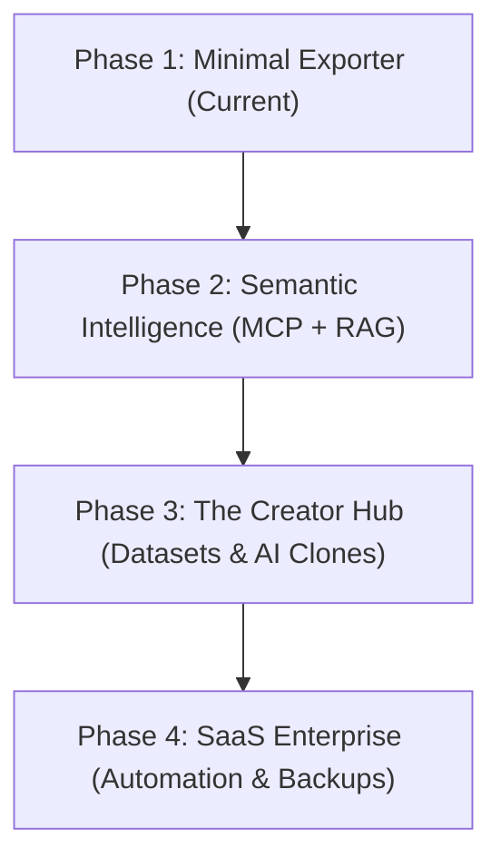

# 🗺️ TG2AI — Product Vision & Roadmap 2.0

This document outlines the long-term vision, architectural evolution, and monetization strategies for **TG2AI** (`@tg2aiibot`). It serves as a blueprint for core maintainers and open-source contributors.

---

## 🎯 The Core Paradigm Shift

Traditionally, the web was built for human consumption (heavy HTML, visual styling, visual elements). In the AI era, **data must be built for machine consumption (Machine-Readable Web)**. 

Telegram is the largest, most underrated decentralized database of human expertise. However, feeding raw Telegram exports to Large Language Models (LLMs) is highly inefficient due to service code bloat, leading to massive token costs and prompt dilution.

**TG2AI sits exactly in the middle as the premium "AI-ready Data Bridge".**

---

## 🗺️ Product Roadmap

### 📍 Phase 1: Minimal Exporter (MVP - Current State)
*   **Target:** Individual developers, creators, and enthusiasts.
*   **Key Features:**
    *   Stateless, 10-second public scraping of up to 200 posts via Cheerio.
    *   Formats: Markdown with YAML frontmatter, Structured JSON, and standard CSV.
    *   Token estimation on output.
    *   Multi-channel export bundled in a single `.zip` archive.
    *   Token-efficient compression (`.toon` format).

### 📍 Phase 2: Semantic Intelligence (MCP + RAG)
*   **Target:** AI engineers, RAG systems builders, and Obsidian power-users.
*   **Key Features:**
    *   **Dynamic Live MCP Search:** Instead of downloading huge histories, the AI agent (e.g. Claude, Cursor) queries the channel *live* using semantic search filters over MCP ("search channel @durov for security-related posts").
    *   **In-Memory Embeddings:** Lightweight on-the-fly vector embedding of recent posts to perform instant RAG without storing heavy databases.
    *   **Smart Filtering:** Automated removal of promotional posts, ads, duplicate links, and non-informative service announcements.

### 📍 Phase 3: The Creator Hub (AI Clones & Datasets)
*   **Target:** Authors, bloggers, and course creators looking to monetize their context.
*   **Key Features:**
    *   **Fine-Tuning Dataset Generator:** 1-click export of channel history into structured `JSONL` training format (`{"prompt": "...", "completion": "..."}`) compatible with OpenAI and LLaMA fine-tuning APIs.
    *   **AI Persona Sandbox:** Let creators run a customized ChatGPT instance trained specifically on their Telegram history, allowing them to test their "digital twin".
    *   **Interactive Q&A Embeds:** Export the channel database into a small web widget that creators can paste onto their personal landing pages.

### 📍 Phase 4: SaaS Enterprise (Automation & Backups)
*   **Target:** Companies, media agencies, and startup founders.
*   **Key Features:**
    *   **Automated Git Backups:** Daily cron-jobs that scrape target channels, convert them to clean Markdown, and automatically commit them to the user's private GitHub repository.
    *   **Notion, GitBook & Obsidian Sync:** Direct integrations to push fresh exports to third-party databases.
    *   **Private Channels Support (Phase 2 Scraper):** Authenticated MTProto scraper client handling private channels and group chats via secure user sessions.
    *   **Trend & Sentiment Analytics:** Interactive dashboards displaying keyword popularity, emotional sentiment charts, and competitor virality metrics over time.

---

## 💡 Expansion Ideas & Creative Angles

Here are some additional high-value ideas to set TG2AI apart from generic scrapers:

1.  **AI Daily Audio Digest (Podcast Generator):**
    *   *Concept:* Convert the exported Markdown text of the user's favorite channels into a structured, highly engaging audio script. Use Text-to-Speech (e.g., ElevenLabs) to deliver a personalized 5-minute "daily morning podcast" summarizing their favorite Telegram channels.
2.  **Overton Window & Timing Analyzer:**
    *   *Concept:* Integrate our proprietary timing analyzer to match the channel's historical content trends against general market cycles, telling the user *why now* is the best time to build products in specific niches.
3.  **Automatic English Translation Layer:**
    *   *Concept:* Allow users to auto-translate Russian/foreign Telegram channels into clean English Markdown during the export, unlocking local expert knowledge for the global developer audience.
